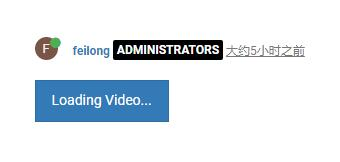
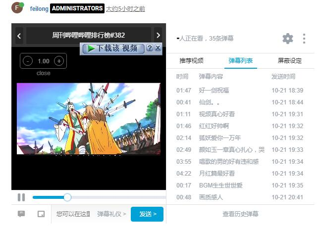

# NodeBB BiliBili Plugin

This NodeBB plugin allows users to embed [BiliBili](http://www.bilibili.com/) videos inline in their posts.

## Installation

    npm install nodebb-plugin-bilibili

## screenshots

when user read something have bilibili video(url like http://www.bilibili.com/video/av15587111/),you can see button like below.

then you can click it.

wait few second,you will find video is loading.

then you can watch the video.

